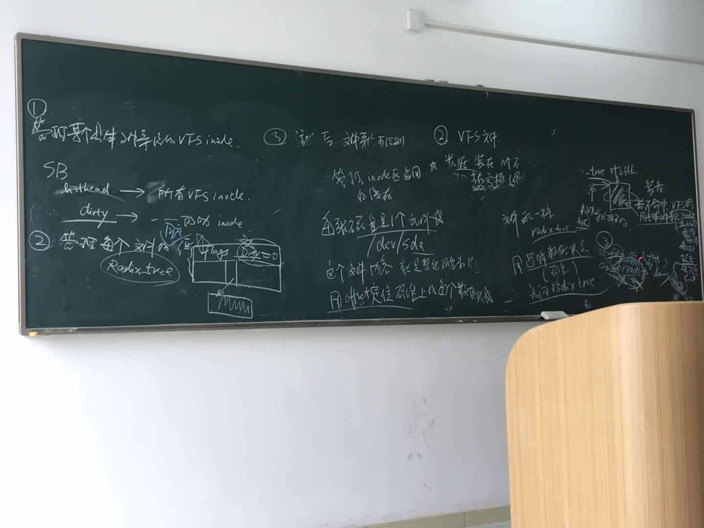

# Linux 文件系统

1. VFS
   1. 每一个文件都有一个unique的文件名，按名存取
   2. 每一个文件有一个inode: 文件的静态属性
   3. 每一个文件存储了数据： 从核心态缓存读取数据， 缓存块是用来存放文件数据的Page(主存页框)
   4. 访问文件需要的函数: 与文件所在文件系统相关
2. 具体文件系统
   1. 磁盘上文件系统
      1. 磁盘上的文件系统，永久存储的文件
         1. FAT, NTFS:微软系列
         2. UNIX/LINUX风格
      2. TTY, 终端系统输入输出
      3. Socket
      4. 除tty的所有外设
      5. proc/systs: 数据取自内核变量，为应用程序提供方便访问内核变量手段

3. VFS 目录搜索
   1. Linux 目录文件: Item: <文件名，inodeID>
   2. 从树根开始
      1. 读取父目录文件
      2. 遍历父目录文件，匹配文件名字符串
      3. 1+2开销大，加速:
         1. windows: 每个目录配一个B+树，目录文件中的每一个目录项在B+树管理下就是有序的
         2. unix/linux: 近期使用过的所有目录项缓存(dentry)
            1. dentry中文件名不是绝对路径，是绝对路径中一个分量，例如"home"
```
    dentry{
        string 文件名;
        int dev;
        int inode;
        ListHead childDentry;
        ListHead sibling;
    }
```
4. 具体文件系统<EXT2为例>
   1. SuperBlock: 登记了文件卷的布局
   2. inode集合:
   3. 数据区
   4. [ SuperBlock | inode集合 | 数据区 ] 组成一个文件卷； 每一个文件卷有一个 type + magic number(登记在SB中，是一个int，取决于文件系统)
   5. 具体访问方法:
      1. 有读superblock的方法
      2. 读inode的方法
      3. 知道根目录的位置
      4. read/write/create 方法
      5. 磁盘空闲空间管理 ** 
         1. Windows风格磁盘: FAT表
         2. Unix: 空闲inode(IB)+空闲数据块(DB)
      6. 解析目录文件的方法
      7. 传统内核: 文件系统要注册，使系统知道访问文件系统的函数，并对应一个magic number
5. 文件系统的元数据是硬盘上的数据结构: SuperBlock + inode + 目录项 + bitmaps
   1. 根目录是#2号文件， #0是指该目录项是空的， #1文件登记磁盘上坏的扇区，是Unix文件系统的隐藏文件，在数据区最开始的某个数据区
6. 目录文件: 第一个目录项: <myself|.>; 第二个目录项: <father|..>; 其他...； 第一个和第二个存在的意义是可以支持相对路径.
7. VFS:
   1. task_struct: 
      1. fs-> <根目录 + 当前空做目录>
      2. files-> <#0 file> -> <#1 file> -> ... <#x FILE> (FILE链表)
      3. 数据装在n个不相邻的主存页框， 若不命中，VFS会调用具体的文件系统中的read，从磁盘读取4k字节填充到主存页框中
      4. inode中有一根指针指向磁盘上的inode， 还有一根ops指针登记了文件访问方法, 与具体的文件系统相关
      5. FILE结构登记了进程打开的文件的动态信息， 有一个指针指向了磁盘的inode
8. 注册：
   1.  所有文件系统登记在一根链表上，每个node(struct fs_types)中有个指针记录了这个文件系统的所有函数
9. mount:
   1.  识别magic number
   2.  读取磁盘superblock
   3.  读取磁盘根目录节点(dentry, 整个文件系统的第一个dentry)，并为其构造内存inode，inode中的ops指针指向fs_types结构中的ops
10. 打开一个文件之后会分配一个Radix Tree.
11. 读取元数据：
    1.  硬盘也是一个文件， /dev/sda, 用offset定位磁盘上的每个数据块。
    2.  
    3.  |SB|inodes|data|: 访问data中的数据可以通过 inode.addr + offset 访问， 但是要读取 SB或者inode的数据，是没有办法通过这种方法，因此将磁盘看作是一个文件，在/dev/sda中作为特殊类型文件，可以通过offset直接读取SB+inode的数据

