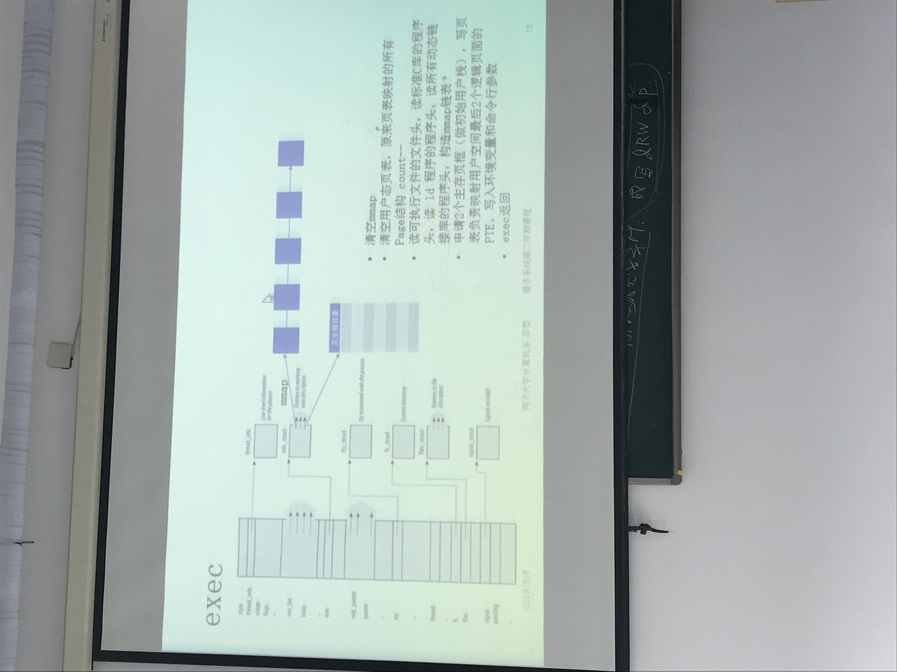

# 进程虚拟地址管理

## 内存区域

- 有文件的段:缺页从文件中填充
  - 代码段：缺页从磁盘
  - 数据段：第一次从磁盘，后面从交换区
  - mmap
- 匿名段：缺页用0填充
  - bss
  - heap
  - 共享内存
  - Stack

## 内存映射

Linux文件系统每一个正在使用的文件有一个address_space和一个内存inode, address_space中有一个radix树，树上的所有叶子节点是主存页框，是这个文件的逻辑内存副本。内存inode中有一个i_address数组，登记了这个文件所有逻辑页面在磁盘上的地址。

address_space是Linux内核中的一个关键抽象，它被作为文件系统和页缓存的中间适配器，用来指示一个文件在页缓存中已经缓存了的物理页。因此，它是页缓存和外部设备中文件系统的桥梁。如果将文件系统可以理解成数据源，那么address_space可以说关联了内存系统和文件系统。

- 读文件A 5000字节
  - 找到A的address_space结构-> radix树
  - 5000/4096 = 1  -> 读文件的#1逻辑页
  - 用 #1 作为索引，去查询radix树上与 #1 对应的叶子节点
    - 如果 #1 叶子节点非0, 假设数值为2356, 说明 #2356 页框中有要访问的数据且存在于缓存中
    - 如果 #1 叶子节点是0, 为文件A分配一个主存页框（假设为9876）， 把9876填入radix树#1叶子节点， 然后IO磁盘。IO命令是读A文件的#1号逻辑页装入9876页框（从打开文件的inode中的i_address数组中查询,读取i_address[1]的数据，该数据块是连续8个扇区的磁盘物理地址，写入9876 * 4k的内存物理地址；该过程是一个DMA操作）
  - 取物理页框（2356/9876）中的904个字节

### 可执行文件(函数库文件)结构

结构| 
---|
程序头|
逻辑段#1|
...|
逻辑段#m|
符号表|

程序头|
---|
VM-start,VM-length, 文件中的起始地址， 文件中长度， prot|#1 段头
...|#2 段头
...|...
...|#n 段头

m <= n(程序文件共有n个段)： 因为有些逻辑段落有初值：代码段(ROX)，只读数据段(常量，RO~X)，全局变量(RW~X)(m个有初值的逻辑段)， 有些没有(n-m个)例如BSS(RW~X)

进程 task_struct->mm_struct->mmap-> 内存区域描述符列表(链表)[根据n个段头构造的n个memory region]

# 缺页异常

当进程给出逻辑地址VA， MMU会 p=floor(VA/4k), 用这个逻辑页号查询现运行进程页表，使用PTE[p]进行地址映射，如果PTE[p]无法进行地址映射，进程缺页。

完成地址映射充要条件: 用户态运行 + 有读权限或读写权限

缺页异常处理：

1. 搜集mmap 看VA是否落在合法内存区域
   1. 如果找到 B, 则 VA一定落在合法内存区域
   2. 如果没有找到,
      1. 如果VA访问的是active堆栈的栈顶附近，则也是合法的(stack的push操作引发的缺页中断)(附近: ESP - VA < 32byte>),此时找到堆栈对应的在mmap中的memory region, size += 4k, vm_start -= 4K(扩充堆栈)， 并分配新的主存页框&写PTE。 这种缺页没有进行磁盘IO，叫做minor page fault。

2. 所缺页面 B 是代码页面
   1. X = VA - B.vm_start + file_start 为CPU要取的下一条指令在文件中的地址。 
   2. floor(X/4K) 作为逻辑页号， 查询address_space中的radix树，(如果Raidx没有叶节点，进行读取文件操作; 如果有的话说明其他进程也访问了该代码文件。因为代码文件对应一个唯一的address_space, 而不是进程。)把radix树中对应叶子节点的值添到PTE，并把B的prot填入PTE。

## fork

父进程的PTE复制给子进程，RO的PTE不修改， RW改成RO(copy-on-write),所有PTE引用的页框count++。

一开始父子进程引用相同的数据页面, 只有其中一个进程要写的时候才会write（copy-on-write）

## exec

## 应用程序执行

1. 执行main函数第一条指令 -> 一定缺页 -> 填好第一张代码 页面
2. 访问全局变量 -> 一定缺页 -> 在 i 号页面， if(PTE[i]==0) 说明第一次访问， 读取address_space->Radix树获取初值(有可能会IO磁盘)； else 读取swap交换区 swap-in
3. BSS：刷成0

## copy-on-write

1. 数据页面在fork前，父进程访问过，则PTE[i]!=0，如果缺页， 看PTE[i].Base对应页框的count， 如果count > 1,就是需要copy-on-write, 分配新的页框，挂在自己的页表，复制原来页框到新页框，old page count --, new page RO->RW; 如果 count == 1, 则是另外一个进程 将PTE[i]的RO->RW.

2. PTE[i]==0(exec 后 立即 fork)， 代码页面只需要一个进程从磁盘IO，另一个从radix中直接查询页框号； 数据页面：第一个进程就会从可执行文件读取数据，将页表挂在radix， 第二个进程也会重复这个过程，因为fork之前没有对数据进行操作，并且另一个进程可能会修改数据，所以不能同步。